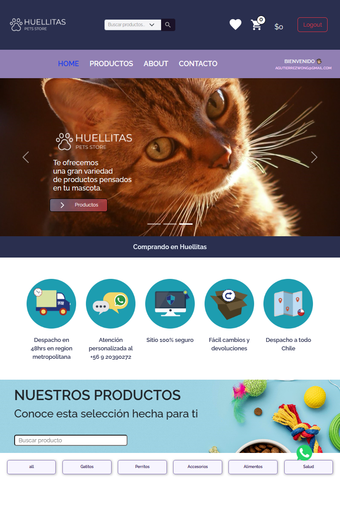

# Huellitas Pets Store

## Web Project e-commerce de accesorios y suplementos para mascotas

* Proyecto final de termino de carrera Front-End React, Academia Desafío Latam.
* Para mi proyecto final, desarrolle desde cero esta aplicación utilizando React y Vite.
* Para darle estilos trabaje con las librerías React-Bootstrap y Material UI.
* Para la autenticación y creación de usuarios utilice Firebase, creando los formularios con Material UI, Formik y Yup.
* Para el consumo de API Rest lo hice a traves de Axios creando mi propio archivo Json llamándolo desde Firebase, al igual que las imagenes que consumo a traves de toda la aplicación, de esta manera realice los request en tiempo real para optimizar mi pagina.
* Para la sección de contacto utilice Email.js para el envío de correos al contacto central.
* Por ultimo, aplique algunas transiciones entre vistas y cargas de productos por medio de Framer-Motion y React-Transition.

### Dependencias

* React
* React Router Dom
* React Bootstrap
* Material UI
* Axios
* Formik
* Firebase
* Sass
* Yup
* Framer-Motion
* Animated.css
* Email.js

## Screen shot del proyecto

## Deploy

* [Deployed by Netlify](https://huellitas-petsstore-deployed.netlify.app/)

## Video Cuestionario proyecto final

* [Video subido a YouTube](https://youtu.be/4n95frIfu44)
