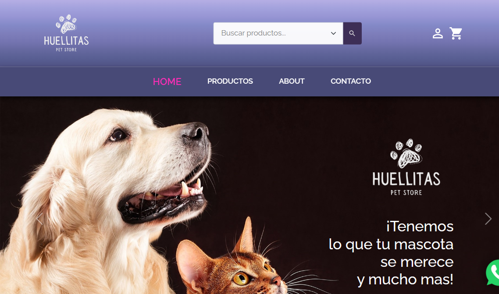

# Huellitas Pets Store

## Web Project e-commerce de accesorios y suplementos para mascotas

* Proyecto final de término de carrera Front-End React en la Academia Desafío Latam.
* Para este proyecto puse en práctica lo aprendido en el Bootcamp. Desarrollé desde cero esta aplicación en ReactJs y levanté el proyecto con Vite. Para los estilos, empleé React-Bootstrap y Material UI. Para la autenticación y creación de usuarios, apliqué los formularios de Formik, Yup, Material UI y Firebase.
* Para el consumo de API Rest utilice Axios. La base de datos utilizada es un Json creado por mí en Firebase. Las imágenes que consumo a través de toda la aplicación son llamadas del storage de Firebase.
* Para la sección de contacto utilicé Email.js para el envío de correos. Por último, apliqué algunas transiciones entre vistas y cargas de productos por medio de Framer-Motion y Animate.css.

### Dependencias

* React
* React Router Dom
* React Bootstrap
* Material UI
* Axios
* Formik
* Firebase
* Sass
* Yup
* Framer-Motion
* Animate.css
* Email.js

## Screen shot del proyecto

## Deploy

* [Deployed by Netlify](https://huellitas-pets-store.netlify.app/)

## Video Cuestionario proyecto final

* [Video subido a YouTube](https://youtu.be/4n95frIfu44)
